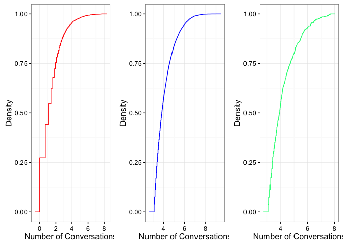
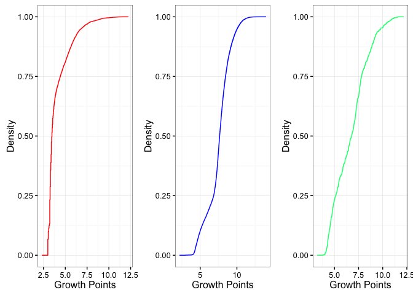
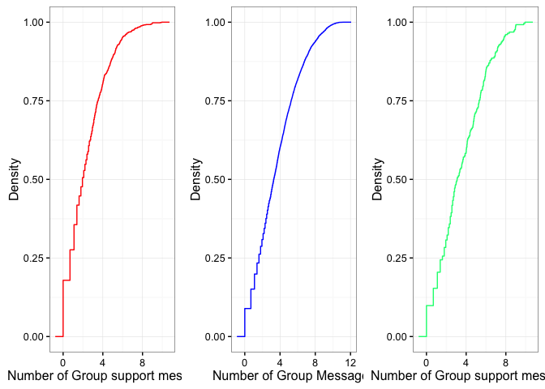
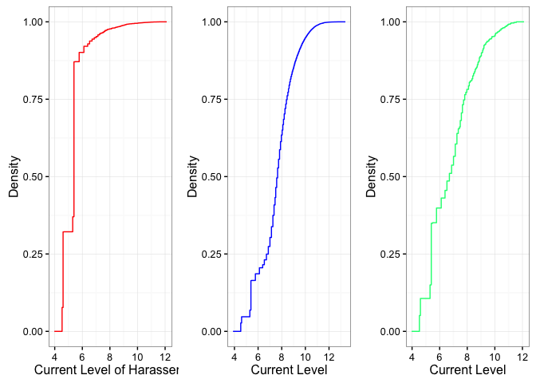
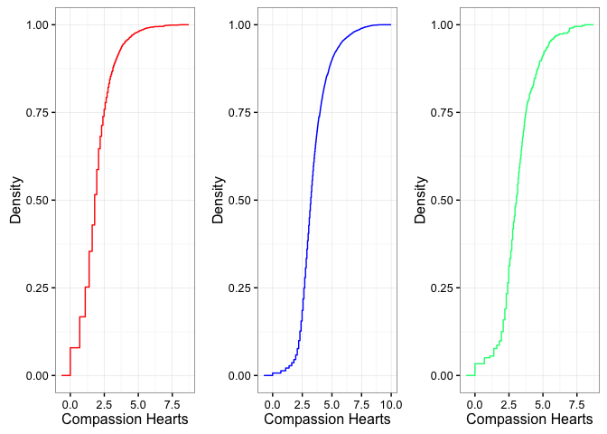
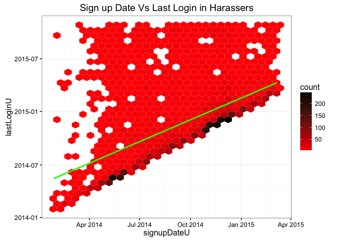
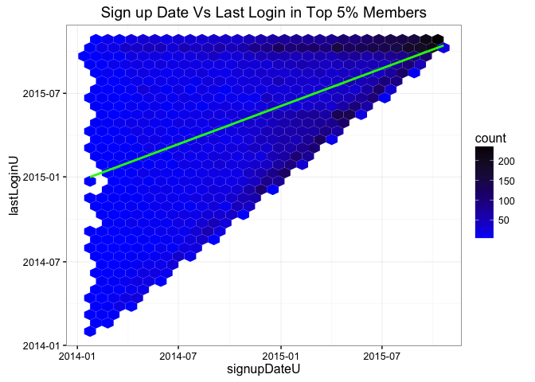
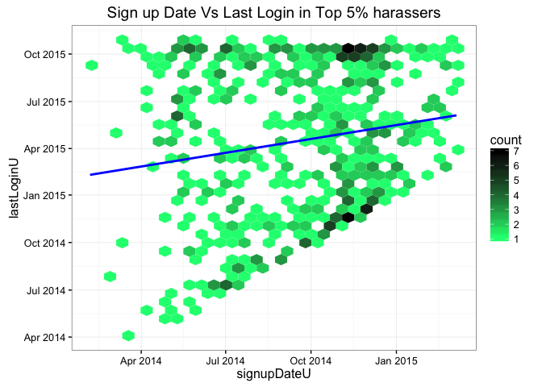

# Behavior of Harassers, Top 5% members and Top 5% harassers on 7cot


```r
library(ggplot2)
```

```
## Warning: package 'ggplot2' was built under R version 3.1.3
```

```r
library(gridExtra)
```

```
## Warning: package 'gridExtra' was built under R version 3.1.3
```

```r
nch<-ggplot(harassers,aes(log(harassers$numConversations)))+stat_ecdf(color="red")+theme_bw()+labs(x="Number of Conversations",y="Density",main="Number of Conversations by Harassers")
ncn<-ggplot(top_5,aes(log(top_5$numConversations)))+stat_ecdf(color="blue")+theme_bw()+labs(x="Number of Conversations",y="Density",main="Number of Conversations of Top 5% members")
nch5 <-ggplot(har_5,aes(log(har_5$numConversations)))+stat_ecdf(color="springgreen")+theme_bw()+labs(x="Number of Conversations",y="Density",main="Number of Conversations by Top 5% harassers")
grid.arrange(nch,ncn,nch5,ncol=3)
```

```
## Warning: Removed 625 rows containing non-finite values (stat_ecdf).
```



### CDF of Number of conversations. X axis is in log scale


```r
library(ggplot2)
library(gridExtra)
gph<-ggplot(harassers,aes(log(harassers$growthPoints)))+stat_ecdf(color="red")+theme_bw()+labs(x="Growth Points",y="Density",main="Growth Points of Harassers")
gpn<-ggplot(top_5,aes(log(top_5$growthPoints)))+stat_ecdf(color="blue")+theme_bw()+labs(x="Growth Points",y="Density",main="Number of Growth Points of Top 5% members")
gph5<-ggplot(har_5,aes(log(har_5$growthPoints)))+stat_ecdf(color="springgreen")+theme_bw()+labs(x="Growth Points",y="Density",main="Growth Points of Top 5% Harassers")
grid.arrange(gph,gpn,gph5,ncol=3)
```



### CDF of Growth Points. X axis in log scale 


```r
library(ggplot2)
library(gridExtra)
gsmh<-ggplot(harassers,aes(log(harassers$groupSupportMsgs)))+stat_ecdf(color="red")+theme_bw()+labs(x="Number of Group support messages",y="Density",main="Number of GSM by Harassers")
gsmn<-ggplot(top_5,aes(log(top_5$groupSupportMsgs)))+stat_ecdf(color="blue")+theme_bw()+labs(x="Number of Group Messages",y="Density",main="Number of Group Messages of Top 5% members")
gsmh5<-ggplot(har_5,aes(log(har_5$groupSupportMsgs)))+stat_ecdf(color="springgreen")+theme_bw()+labs(x="Number of Group support messages",y="Density",main="Number of GSM by top 5% harassers")
grid.arrange(gsmh,gsmn,gsmh5,ncol=3)
```

```
## Warning: Removed 4876 rows containing non-finite values (stat_ecdf).
```

```
## Warning: Removed 8012 rows containing non-finite values (stat_ecdf).
```

```
## Warning: Removed 279 rows containing non-finite values (stat_ecdf).
```



### CDF of GSM. X axis in log scale


```r
library(ggplot2)
library(gridExtra)
clh<-ggplot(harassers,aes(log(harassers$currentLevel)))+stat_ecdf(color="red")+theme_bw()+labs(x="Current Level of Harassers",y="Density",main="Current Level of Harassers")
cln<-ggplot(top_5,aes(log(top_5$currentLevel)))+stat_ecdf(color="blue")+theme_bw()+labs(x="Current Level",y="Density",main="Current Level of Top 5% members")
clh5<-ggplot(har_5,aes(log(har_5$currentLevel)))+stat_ecdf(color="springgreen")+theme_bw()+labs(x="Current Level",y="Density",main="Current Level of top 5% harassers")
grid.arrange(clh,cln,clh5,ncol=3)
```

```
## Warning: Removed 797 rows containing non-finite values (stat_ecdf).
```

```
## Warning: Removed 191 rows containing non-finite values (stat_ecdf).
```

```
## Warning: Removed 6 rows containing non-finite values (stat_ecdf).
```



### CDF of current level. X axis in log scale.


```r
library(ggplot2)
library(gridExtra)
chh<-ggplot(harassers,aes(log(harassers$compassionHearts)))+stat_ecdf(color="red")+theme_bw()+labs(x="Compassion Hearts",y="Density",main="Compassion Hearts of Harassers")
chn<-ggplot(top_5,aes(log(top_5$compassionHearts)))+stat_ecdf(color="blue")+theme_bw()+labs(x="Compassion Hearts",y="Density",main="Compassion Hearts of Top 5% members")
chh5<-ggplot(har_5,aes(log(har_5$compassionHearts)))+stat_ecdf(color="springgreen")+theme_bw()+labs(x="Compassion Hearts",y="Density",main="Compassion Hearts of Top 5% harassers")
grid.arrange(chh,chn,chh5,ncol=3)
```

```
## Warning: Removed 3887 rows containing non-finite values (stat_ecdf).
```

```
## Warning: Removed 1970 rows containing non-finite values (stat_ecdf).
```

```
## Warning: Removed 117 rows containing non-finite values (stat_ecdf).
```



### CDF of compassion Hearts. X axis in log scale


```r
library(ggplot2)
ggplot(harassers,aes(signupDateU,lastLoginU)) + stat_binhex() + scale_fill_gradient(low="red",high="black") + ggtitle("Sign up Date Vs Last Login in Harassers") + geom_smooth(size=1,method="lm",linetype=1,se=FALSE,color="green") + theme_bw()
```




```r
ggplot(top_5,aes(signupDateU,lastLoginU)) + stat_binhex() + scale_fill_gradient(low="blue",high="black") + ggtitle("Sign up Date Vs Last Login in Top 5% Members") + geom_smooth(size=1,method="lm",linetype=1,se=FALSE,color="green") + theme_bw()
```




```r
library(ggplot2)
ggplot(har_5,aes(signupDateU,lastLoginU)) + stat_binhex() + scale_fill_gradient(low="springgreen",high="black") + ggtitle("Sign up Date Vs Last Login in Top 5% harassers") + geom_smooth(size=1,method="lm",linetype=1,se=FALSE,color="blue") + theme_bw()
```



### Sign up Date versus Last Login Time


