# Behavior of Harassers and Normal Users on 7cot

## Harassers CDF plots to find out how their behavior is on 7cot


```r
plot(h1.cdf,xlab="Number of Conversations",ylab="Density",main="CDF of Number of Conversations of harassers",col="blueviolet")
```

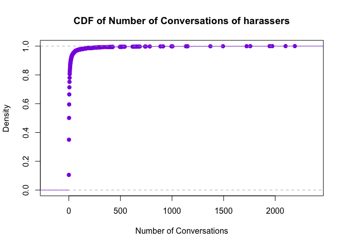

```r
plot(h1.cdf,xlab="Number of Conversations",ylab="Density",main="CDF of Number of Conversations of harassers",col="blueviolet",xlim=c(0,100))
```

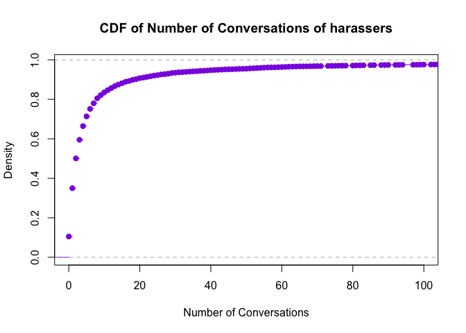

### The plot shows CDF plot of number of conversations a harasser make on the website. As per the plot about 80% harassers have 10 or less conversations, thus suggesting that majority of the harassers are not active on the website


```r
library(ggplot2)
```

```
## Warning: package 'ggplot2' was built under R version 3.1.3
```

```r
hex_harassers <- ggplot(harassers,aes(signupDateU,lastLoginU)) + stat_binhex() + scale_fill_gradient(low="blueviolet",high="black") + ggtitle("Sign up Date Vs Last Login in Active Members (Top 10%") + geom_smooth(size=1,method="lm",linetype=1,se=FALSE,color="green")
print(hex_harassers)
```

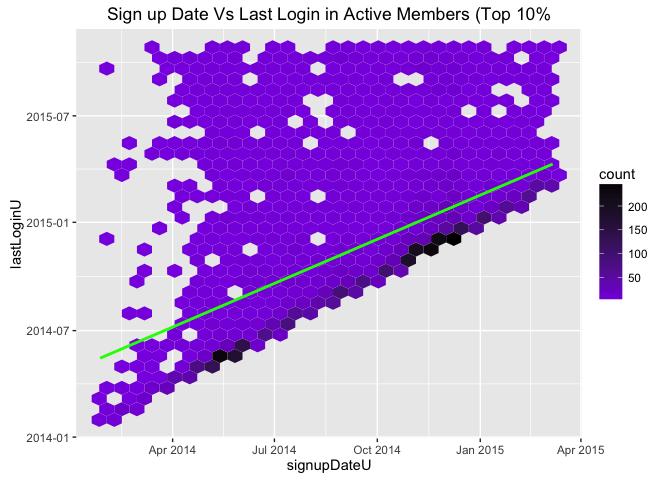

### This plot shows the sign up date versus last login time of the harassers. From the plot it is pretty much evident that the harassers did not login in a more advanced time from the day when they signed up on the website. This also suggests that harassers are not much interested on the website, their main motivation is to just harass a few people and probably never return back.


```r
plot(h4.cdf,xlab="Growth Points",ylab="Density",main="CDF of Growth Points of harassers",xlim=c(0,1000),col="blueviolet")
```

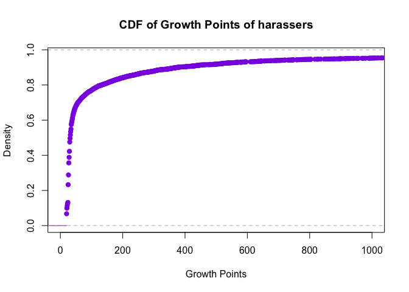

### The plot shows CDF of the growth Points of Harassers. As per the plot around 80% of the harassers have 200 or less growth points, which was quite expected from them as they are not much active on the website.


```r
plot(h5.cdf,xlab="Group Support Messages",ylab="Density",main="CDF of Group Support Messages of harassers",col="blueviolet",xlim=c(0,100))
```

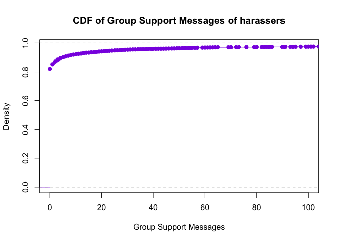

### The plot shows the CDF of group support messages of harassers. As per the plot around 90% of the harassers have 10 or less group support messages thus making our hypothesis stronger that harassers are dull users on the website.


```r
plot(h6.cdf,xlab="Current Level",ylab="Density",main="CDF of Current Level of harassers",col="blueviolet",xlim=c(0,5000))
```

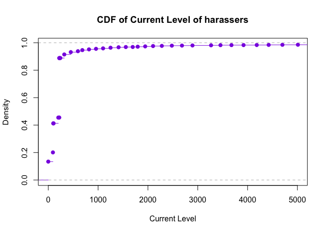

### The plot shows the CDF of current Level of Harassers. As per the plot around 90% of harassers have a level of 250 or less. Lets compare this with top 5% members.

# Top 5% member CDF plots to determine whether there is significant differences in the behavior of members and harassers on the website 


```r
plot(n5.nc,xlab="Number of Conversations",ylab="Density",main="Number of Conversations of top 5% members",col="firebrick")
```

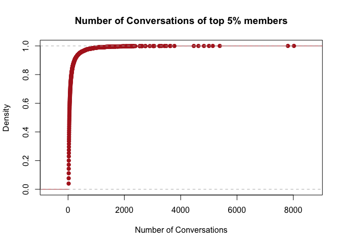

```r
plot(n5.nc,xlab="Number of Conversations",ylab="Density",main="Number of Conversations of top 5% members",col="firebrick",xlim=c(0,2000))
```

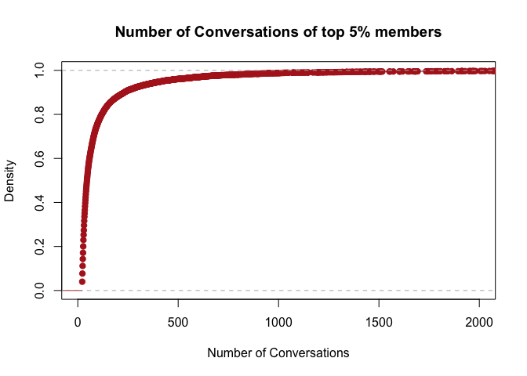

### This plot shows CDF of the Number of Conversations in normal members. As per the plot around 90% of normal members have 250 or less conversations thus showing how active these users are.


```r
library(ggplot2)
hex_normal5 <- ggplot(top_5,aes(signupDateU,lastLoginU)) + stat_binhex() +scale_fill_gradient(low="firebrick1",high="black") + ggtitle("Sign up Date Vs Last Login in Active Members (Top 5%)") + geom_smooth(size=1,method="lm",linetype=1,se=FALSE,color="blue")
print(hex_normal5)
```

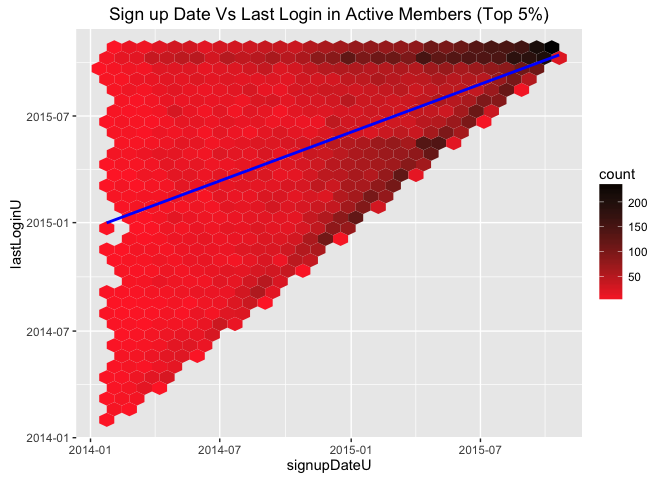

###  This plot shows the sign up date versus last login time of the normal members. From the plot it is pretty much evident that the normal users had last login times in a more advanced time from the day when they signed up on the website. Thus suggesting that normal users are heavily involved on the website.


```r
plot(n5.gp,xlab="Growth Points",ylab="Density",main="CDF of Growth Points of Top 5% Members",col="firebrick",xlim=c(0,40000))
```

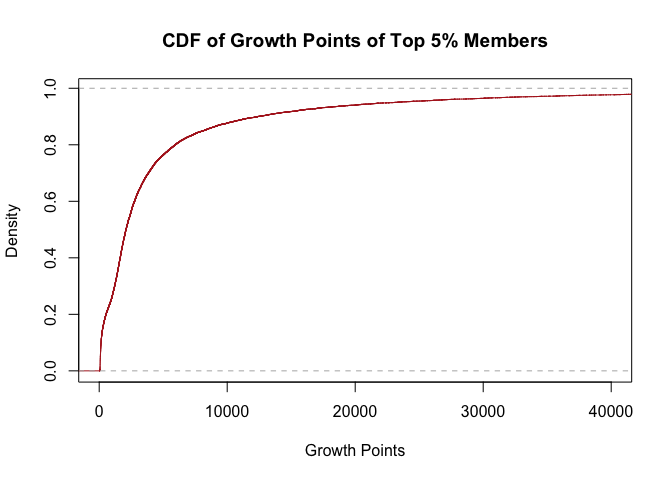

### This plot shows CDF of the growth points of the normal members. The plot tells us that around 80% of normal members have around 5000 growth points, which is quite significant as compared to the harassers.


```r
plot(n5.gsm,xlab="Group Support Messages",ylab="Density",main="CDF of Group Support Messages of Top 5% Members",col="firebrick",xlim=c(0,750))
```

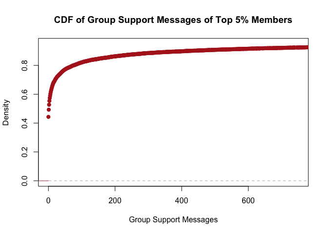

### This plot shows CDF of the group support messages of the normal members. The plot tells us that around 80% of normal members have 100 or less group support messages, which is still much greater than harassers.


```r
plot(n5.cl,xlab="Current Level",ylab="Density",main="CDF of Current Level of Top 5% Members",col="firebrick",xlim=c(0,80000))
```

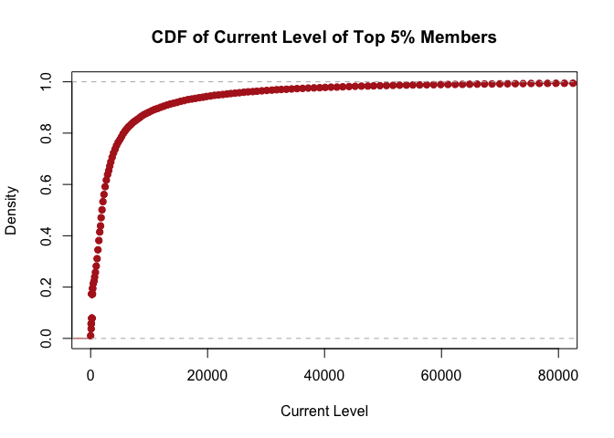

### This plot shows CDF of the current level of normal members. As per the plot around 90% of the normal members have a level of 10,000 or less. This is sigificantly high as compared to harassers.


### Thus comparing the CDF plots it is clear that normal members (top 5%) have significantly higher growth points, current level and much higher number of conversations, group support messages. The hex bin plot also tells us that normal members (top 5%) have a last login time at almost one year from the day they signed up on the website and further supports our claim that they are actively involved on the website as compared to harassers. 


