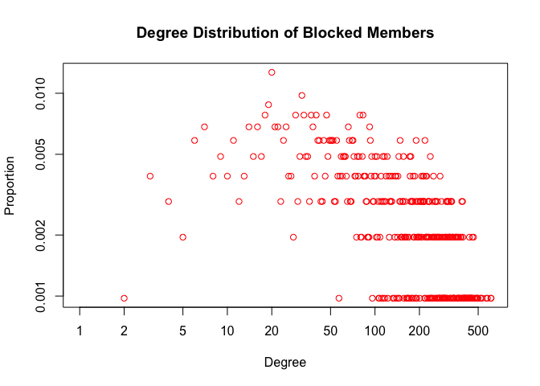

# Network Features
**Network Features of Blocked member-member projection network.**

 1. Number of Nodes : **1025**
 2. Number of Edges : **75452**
 3. Mean Degree Centrality : **0.1436**  (centrality scores are normalized)
 4. Mean Betweenness Centrality : **0.5167**
 5. Mean Closeness Centrality : **4.72e-07**
 6. Mean Clustering Coefficient : **0.5591**
 7. Network Density : **0.1437**
 8. Network Diameter : **4**
 9. Network Modularity : **-0.0016**
 10. Giant Connected Component : **100%** (All nodes are part of gcc)
 11. Assortativity : **-0.0177**
 12. Average Path Length : **1.96729**
 13. Global Clustering Coefficient : **0.46933*
 
**Network Features of Normal member-member projection network.**

 1. Number of Nodes : **12,419**
 2. Number of Edges : **13,56,828**
 3. Mean Degree Centrality : **0.0175**  (centrality scores are normalized)
 4. Mean Betweenness Centrality : **0.6534**
 5. Mean Closeness Centrality : **2.0021e-10**
 6. Mean Clustering Coefficient : **0.3478**
 7. Network Density : **0.0175**
 8. Network Diameter : **6**
 9. Network Modularity : **-0.000155**
 10. Giant Connected Component : **99.75%** (Almost all nodes are part of gcc)
 11. Assortativity : **0.001**
 12. Average Path Length : **2.300**
 13. Global Clustering Coefficient : **0.20174**


####The high betweenness centrality, relatively high closeness centrality and network density as compared to normal member projection network; Lower diameter, weak negative degree assortativity and small average path lengths may be indicative of core-periphery structure in blocked member projection network.

####On the contrary, the extremely low closeness centrality and weak positive degree assortativity may indicate absence of core-periphery structure in normal member projection network.


The above plot shows a CDF plot of Betweenness Centrality of normal member and blocked member projection network. 


The above plot shows a CDF plot of Closeness Centrality of Blocked Member Projection Network.


The above plot shows a CDF plot of Closeness Centrality of Normal Member Projection Network.


```
## 
## Attaching package: 'igraph'
```

```
## The following objects are masked from 'package:stats':
## 
##     decompose, spectrum
```

```
## The following object is masked from 'package:base':
## 
##     union
```



The above plot shows the Degree Distribution plot of blocked members projection network


The above plot shows the Degree Distribution plot of normal members projection network.


The above plot shows the Local Clustering Coefficient of blocked member projection network.


The above plot shows the Local Clustering Coefficient of normal member projection network.
  
