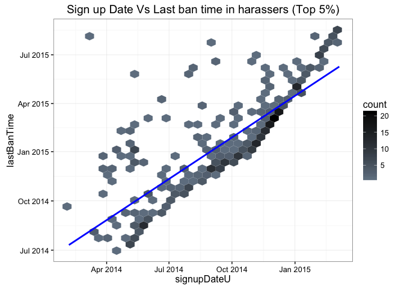
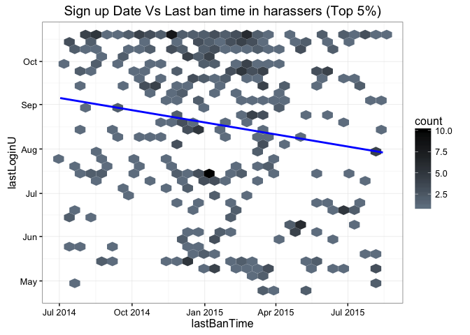
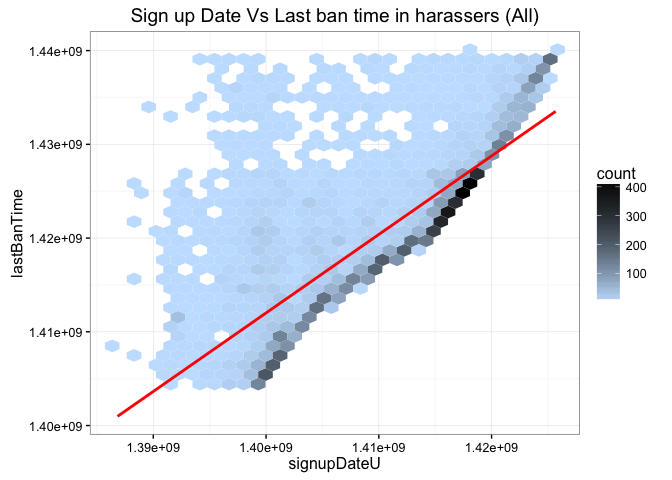

# Last ban time, Last login time and sign up date of top 5% harassers compared to all harassers

## Top 5% Harassers

We hypothesize that majority of harassers are not actively involved on website, but few of them actually show behavior similar to that of top 5% normal members. So to check this we compare their last ban time against sign up date and last login times. 


```r
library(ggplot2)
```

```
## Warning: package 'ggplot2' was built under R version 3.1.3
```

```r
sort_plot2 <- ggplot(sorthar,aes(signupDateU,lastBanTime)) + stat_binhex() +scale_fill_gradient(low="slategray",high="black") + ggtitle("Sign up Date Vs Last ban time in harassers (Top 5%)") + geom_smooth(size=1,method="lm",linetype=1,se=FALSE,color="blue")+theme_bw()
print(sort_plot2)
```



The hex bin plot shows sign up date versus last ban time in top 5% harassers. From the plot it is clear that the sign up date and last time they were banned from a listener are highly correlated. We hypothesize that earlier the harassers who fall in this category (top 5%) might have harassed a listener or few listeners, maybe because they were not in a good state of mind, but subsequently realized that they did wrong and that this website is actually good for them to seek emotional support and thus later they refrained from indulging in these activites. 


```r
library(ggplot2)
sort_plot <- ggplot(sorthar,aes(lastBanTime,lastLoginU)) + stat_binhex() +scale_fill_gradient(low="slategray",high="black") + ggtitle("Sign up Date Vs Last ban time in harassers (Top 5%)") + geom_smooth(size=1,method="lm",linetype=1,se=FALSE,color="blue")+theme_bw()
print(sort_plot)
```



The hex bin plot shows the last ban time versus last login time of top 5% harassers. From the plot it is quite clear that last ban time and last login time of top 5% harassers are not correlated. This further supports our hypothesis that the harassers falling in top 5% category have refrained from doing the malpractices which they earlier did and now behave normally. We can say this by the fact that they have a recent last login time and they were banned quite a long time ago (during their inital days on website). The Y axis is of 2015 year.

## All Harassers


```r
ha_plot <- ggplot(ha,aes(signupDateU,lastBanTime)) + stat_binhex() +scale_fill_gradient(low="slategray1",high="black") + ggtitle("Sign up Date Vs Last ban time in harassers (All)") + geom_smooth(size=1,method="lm",linetype=1,se=FALSE,color="red")+theme_bw()
print(ha_plot)
```



The hex bin plot shows the sign up data versus last ban time in all harassers. We can see both these features are highly correlated. We hypothesize that most of the harassers dont return on the website after harassing few listeners but some % percentage of these show behavior similar to normal members.


```r
ha_plot2 <- ggplot(ha,aes(lastBanTime,lastLoginU)) + stat_binhex() +scale_fill_gradient(low="slategray1",high="black") + ggtitle("Sign up Date Vs Last ban time in harassers (All)") + geom_smooth(size=1,method="lm",linetype=1,se=FALSE,color="red")+theme_bw()
print(ha_plot2)
```


The hex bin plot shows the last ban time versus last login time in all harassers. We see most of the harassers have a last login time during the same time when they got banned as there is a strong correlation. But few of them have last login time in a much recent time from the time they were banned (top 5%).

